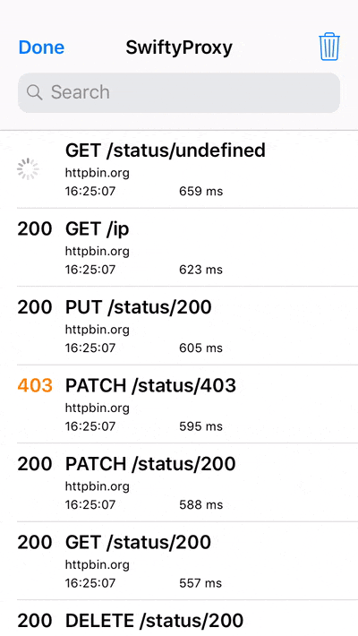

# SwiftyProxy

[](https://travis-ci.org/samirGuerdah/SwiftyProxy)
[](https://cocoapods.org/pods/SwiftyProxy)
[](https://cocoapods.org/pods/SwiftyProxy)
[](https://cocoapods.org/pods/SwiftyProxy)


SwiftyProxy is an In-App http/https intercepter that provides a UI to inspect the content.
It works with URLConnection, URLSession, AFNetworking, Alamofire or any networking framework that use Cocoa's URL Loading System.





## Example

To run the example project, clone the repo, and run `pod install` from the Example directory first.

## Requirements

SwiftyProxy is written in **Swift 4.0** and supports **iOS 10.0** and later. SwiftyProxy doesn't intercept requests made by NSURLConnection.

## Installation

### CocoaPods

SwiftyProxy is available through [CocoaPods](https://cocoapods.org). To install it, simply add the following line to your Podfile:

```ruby
pod 'SwiftyProxy'
```

### Carthage

Add the following dependency to your `Cartfile`:

```none
github "samirGuerdah/SwiftyProxy"
```

## Usage

Enable the SwiftyProxy before doing any request, in the application delegate for example :

```swift
func application(_ application: UIApplication, didFinishLaunchingWithOptions launchOptions: [UIApplicationLaunchOptionsKey: Any]?) -> Bool {
    SwiftyProxy.enable()
    return true
}
```

```objc
// Objective-C
- (BOOL)application:(UIApplication *)application didFinishLaunchingWithOptions:(NSDictionary *)launchOptions {
    [SwiftyProxy enable]
    return true
}
```

## Author

Samir Guerdah, sguerdah@gmail.com

## License

SwiftyProxy is available under the MIT license. See the LICENSE file for more info.
